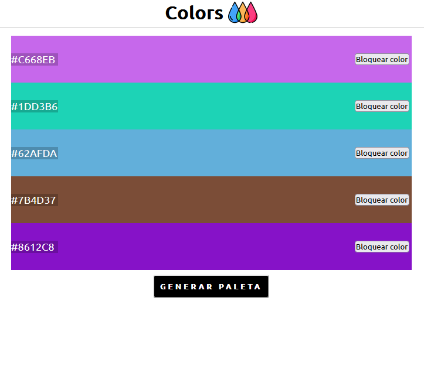

# Generador de paleta de colores 🧑‍🎨

🎨 Generador de paleta de colores responsiva realizada con las siguentes tecnologias:

- Javascript
- Css
- HTML

---
Utiliza la fuente [Ubuntu](https://fonts.google.com/specimen/Ubuntu?query=ubun), que pueden ver haciendo click en el enlace, y tiene la funcionalidad de bloquear el color elegido y seguir cambiando los otros.

---
